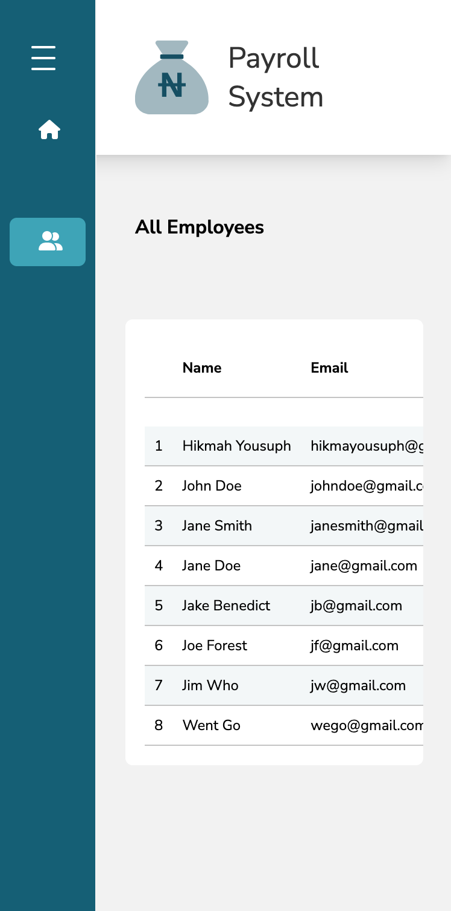

# Payroll System - A payment display application 

This is the documentation for the Payroll System, an application that displays payment information for employees.

## Table of Contents

- [Overview](#overview)
  - [Introduction](#introduction)
  - [Screenshot](#screenshot)
    - [Mobile](#mobile)
    - [Desktop](#desktop)
  - [Links](#links)
  - [Features](#features)
- [Installation](#installation)
- [Endpoints](#endpoints)
- [My Process](#my-process)
  - [Built With](#built-with)
- [Author](#author)

## Overview

### Introduction

This project is a front-end application that uses JSON Server as a fake backend server for CRUD operations on employees. After a successfully created employee is in the database, the user, only if given administrative permission, can choose to print out the payslip information of the employee in a PDF file.

### Screenshot

#### Mobile

   
   
   
   

#### Desktop

   
   
   
   
   

### Links
GitHub: [https://github.com/Hikmahx/payroll-system](https://github.com/Hikmahx/payroll-system)
Live Site URL: [https://payroll-system-hikmahx.vercel.app/](https://payroll-system-hikmahx.vercel.app/)

### Features

Users, if admin, should be able to:

- Create, Read, Update, and Delete employees.
- View a list of all employee.
- View a single employee details.

If not admin, should be able to:
- View their specific details

## Installation

1. Clone the repository.
2. Install the required packages using `npm install`.
4. Start the server: `npm start`

## Endpoints

| Endpoint | Method | Response |
| --- | --- | --- |
| `/employees` | GET | List of all employees |
| `/employees` | POST | Create a new employee |
| `/employees/:id` | GET | Details of a single employee |
| `/employees/:id` | PUT | Update an existing employee |
| `/employees/:id` | DELETE | Delete a single employee |

## My Process

### Built With

- React
- TypeScript
- Tailwind
- Redux Toolkit
- Axios
- Font Awesome
- Concurrently
- React packages: react-router-dom, react-hook-form, react-redux, react-to-print

## Author

- Github - [Hikmah Yousuph](https://github.com/Hikmahx)
- Email - [hikmayousuph@gmail.com](hikmayousuph@gmail.com)
- LinkedIn - [Hikmah Yousuph](linkedin.com/in/hikmah-yousuph-449467204/)